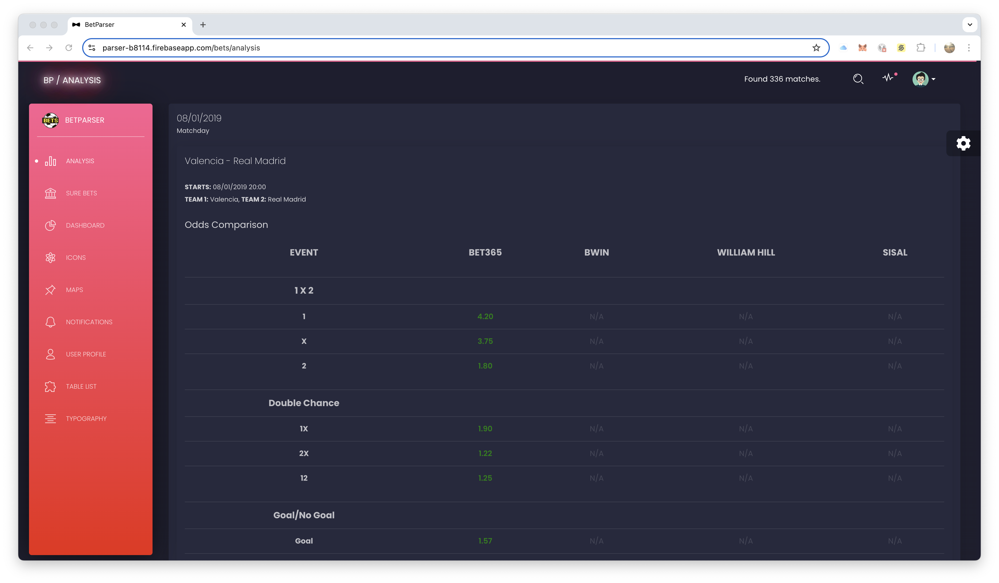
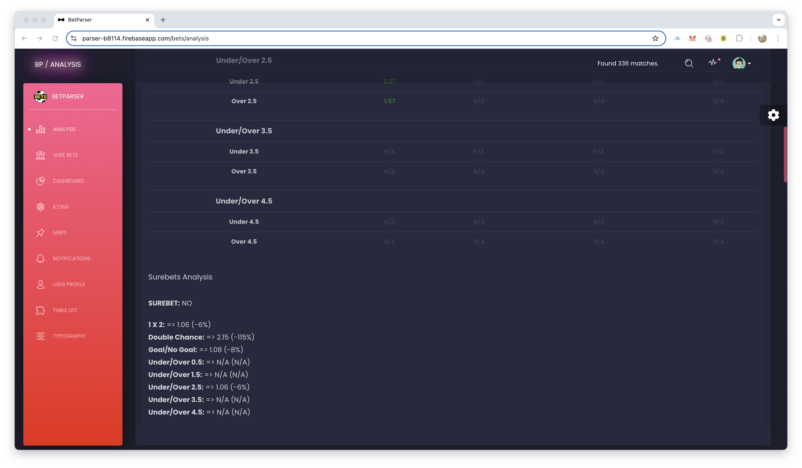
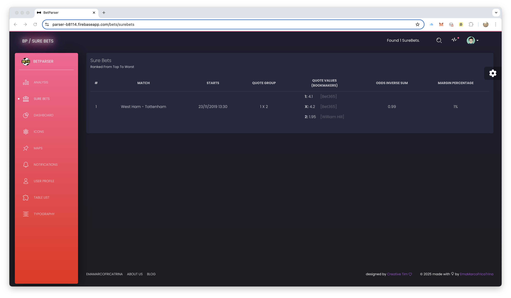

# BetParser WebApp

BetParser WebApp is a modern Angular application for analyzing live betting odds. Built for sports betting enthusiasts and analysts, it provides real-time insights into SureBets and ValueBets, helping users identify profitable opportunities.

## Disclaimer

This software is provided for educational and research purposes only. The authors of this project do not condone or encourage any illegal activities, including but not limited to unauthorized data scraping or infringement of intellectual property rights.

All trademarks, logos, and brand names mentioned in this project (e.g., Bwin, Bet365, William Hill, Sisal, Eurobet, etc.) are the property of their respective owners. The use of these names is for identification purposes only and does not imply endorsement or affiliation.

By using this software, you agree that the authors are not liable for any misuse or legal consequences arising from its use. It is your responsibility to ensure compliance with all applicable laws and regulations in your jurisdiction.

## Table of Contents

1. [Project Overview](#project-overview)
2. [Features](#features)
3. [Screenshots](#screenshots)
4. [Live Demo](#live-demo)
5. [Environment Setup](#environment-setup)
6. [IDE Configuration](#ide-configuration)
7. [Application Configuration](#application-configuration)
8. [UX Template](#ux-template)
9. [Angular Framework Usage](#angular-framework-usage)
10. [License](#license)

## Project Overview

BetParser WebApp is a tool designed to empower sports betting enthusiasts and analysts by providing actionable insights into live betting odds. By leveraging Firebase for real-time data synchronization, the app ensures users can access up-to-date information on SureBets and ValueBets. Additionally, its integration with [BetParser Crawler](https://github.com/mtmarco87/betparser_crawler) allows seamless access to parsed betting data, creating a unified ecosystem for betting analysis. Built with Angular, the app prioritizes responsiveness and ease of use, making it suitable for both casual users and professional analysts.

### Features:

- **Live Odds Analysis**: View and analyze live betting odds in real-time.
- **SureBets and ValueBets Detection**: Automatically identify profitable betting opportunities.
- **Firebase Integration**: Seamlessly sync and access shared data.

### Screenshots

Here are some screenshots of the BetParser WebApp in action:


#### Live Odds Analysis




#### SureBets Detection



## Live Demo

Check out the latest working version of the app here:  
[BetParser WebApp](https://parser-b8114.firebaseapp.com/)

## Environment Setup

### Prerequisites

1. Install a package manager:

   - [Yarn](https://yarnpkg.com/lang/en/docs/install/#windows-stable) (recommended)
   - [Node-NPM](https://nodejs.org/it/download/)

2. Install global tools:
   ```bash
   yarn global add @angular/cli firebase-tools
   # or
   npm install -g @angular/cli firebase-tools
   ```
   - **Angular CLI**: Version >= 8
   - **Firebase CLI**: Version > 7.5

### Steps to Set Up

1. **Install Dependencies**:  
   Open a terminal in the project folder and run:

   ```bash
   yarn install
   # or
   npm install
   ```

2. **Verify Global Tools**:  
   Ensure Angular CLI and Firebase CLI are installed globally.  
   Use the following commands to check versions:

   ```bash
   ng version
   firebase --version
   ```

3. **Learn More**:
   - [Angular CLI Documentation](https://angular.io/cli)
   - [Firebase CLI Documentation](https://firebase.google.com/docs/cli)

## IDE Configuration

1. **Choose an IDE**:  
   Recommended: [Visual Studio Code](https://code.visualstudio.com/) (freeware).

2. **Install VS Code Extensions**:  
   Add these extensions for a better development experience:
   - Angular Files (quick scaffolding)
   - Angular Language Service (template support)
   - Angular Snippets (powerful snippets)
   - Debugger for Chrome
   - HTML Format

## Application Configuration

1. **Firebase DB**:  
   Update the following files with your Firebase DB configuration (API key, domain, etc.):

   - `src/environment/environment.ts`
   - `src/environment/environment.prod.ts`

2. **Google Maps (Optional)**:  
   To enable Google Maps features, replace the `YOUR_MAPS_API_KEY` placeholder in `src/index.html` with your Google Maps API key.

3. **Firebase WebApp Deployment (Optional)**:  
   Deploy the app to Firebase using these commands:
   ```bash
   ng build --prod
   firebase login --interactive
   firebase deploy
   ```
   Additional configuration may be required to set up the target project/cloud storage on Firebase.

## UX Template

Special thanks to [Creative Tim](https://www.creative-tim.com) for the Black Dashboard Angular UI template.  
While heavily reworked, the app's graphical charm is due to their amazing design.

## Angular Framework Usage

### Development Server

Run the following command to start a development server:

```bash
ng serve
```

Navigate to `http://localhost:4200/`. The app will automatically reload when source files are modified.

### Code Scaffolding

Generate a new component, directive, or other Angular elements using:

```bash
ng generate component component-name
ng generate directive|pipe|service|class|guard|interface|enum|module
```

### Build

Build the project with:

```bash
ng build
```

For a production build, use:

```bash
ng build --prod
```

### Running Unit Tests

Execute unit tests via [Karma](https://karma-runner.github.io):

```bash
ng test
```

### Running End-to-End Tests

Execute end-to-end tests via [Protractor](http://www.protractortest.org/):

```bash
ng e2e
```

### Further Help

To get more help on the Angular CLI, use:

```bash
ng help
```

Or visit the [Angular CLI README](https://github.com/angular/angular-cli/blob/master/README.md).

---

This project was generated with [Angular CLI](https://github.com/angular/angular-cli) version 6.0.8.

## License

This project is licensed under the [MIT License](LICENSE). See the `LICENSE` file for more details.
