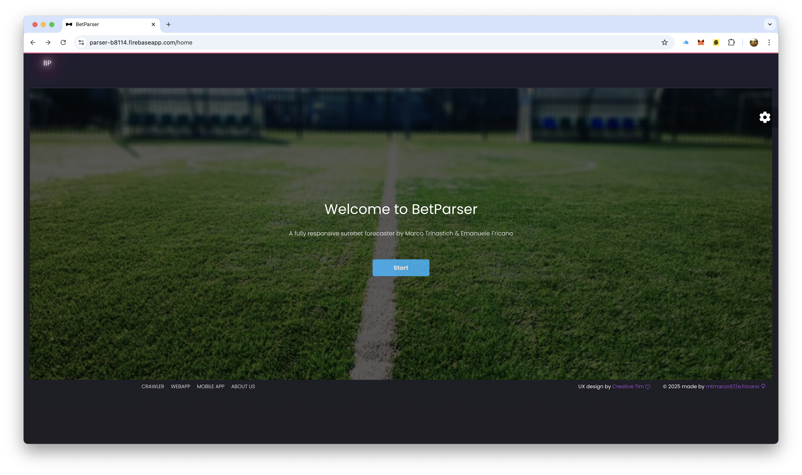
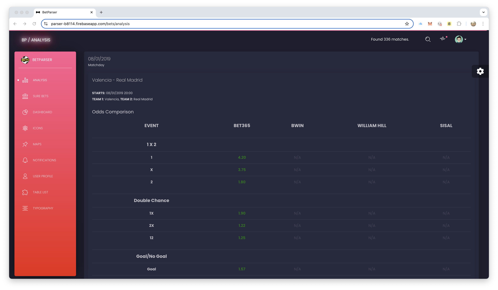
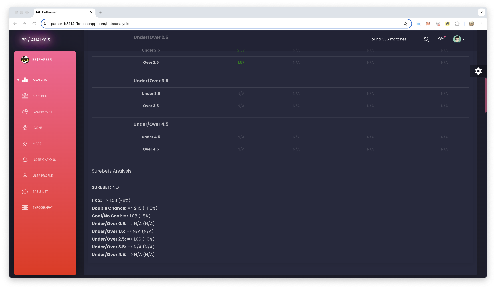
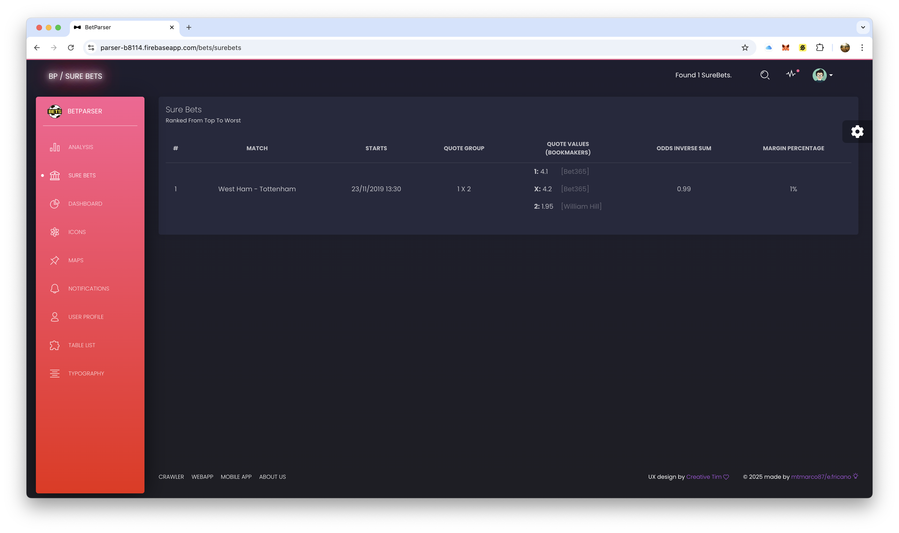

# BetParser WebApp

BetParser WebApp is a modern Angular application for analyzing live betting odds. Built for sports betting enthusiasts and analysts, it provides real-time insights into SureBets and ValueBets, helping users identify profitable opportunities.

## Disclaimer

This software is provided for educational and research purposes only. The authors of this project do not condone or encourage any illegal activities, including but not limited to unauthorized data scraping or infringement of intellectual property rights.

All trademarks, logos, and brand names mentioned in this project (e.g., Bwin, Bet365, William Hill, Sisal, Eurobet, etc.) are the property of their respective owners. The use of these names is for identification purposes only and does not imply endorsement or affiliation.

By using this software, you agree that the authors are not liable for any misuse or legal consequences arising from its use. It is your responsibility to ensure compliance with all applicable laws and regulations in your jurisdiction.

## Table of Contents

1. [Project Overview](#project-overview)
2. [Features](#features)
3. [Screenshots](#screenshots)
4. [Live Demo](#live-demo)
5. [Environment Setup](#environment-setup)
   - [Prerequisites](#prerequisites)
   - [Setup Steps](#setup-steps)
   - [Configuration](#configuration)
6. [Usage](#usage)
   - [How to Run](#how-to-run)
   - [How to Deploy](#how-to-deploy)
7. [Development](#development)
   - [Angular Framework](#angular-framework)
   - [IDE Configuration](#ide-configuration)
8. [Acknowledgments](#acknowledgments)
9. [Support](#support)
10. [License](#license)

## Project Overview

BetParser WebApp is a tool designed to empower sports betting enthusiasts and analysts by providing actionable insights into live betting odds. By leveraging Firebase for real-time data synchronization, the app ensures users can access up-to-date information on SureBets and ValueBets. Additionally, its integration with [BetParser Crawler](https://github.com/mtmarco87/betparser_crawler) allows seamless access to parsed betting data, creating a unified ecosystem for betting analysis. Built with Angular, the app prioritizes responsiveness and ease of use, making it suitable for both casual users and professional analysts.

## Features

- **Live Odds Analysis**: View and analyze live betting odds in real-time.
- **SureBets and ValueBets Detection**: Automatically identify profitable betting opportunities.
- **Firebase Integration**: Seamlessly sync and access shared data.

## Screenshots

Here are some screenshots of the BetParser WebApp in action:



### Live Odds Analysis




### SureBets Detection



## Live Demo

Check out the latest working version of the app here:  
[BetParser WebApp](https://parser-b8114.firebaseapp.com/)

## Environment Setup

### Prerequisites

1. **Install Node Package Manager**:

   - [Node-NPM](https://nodejs.org/it/download/)

2. **Install Global Tools**:  
   Run the following command to install the required tools globally:

   ```bash
   npm install -g @angular/cli firebase-tools
   ```

3. **Verify Global Tools**:
   Ensure Angular CLI and Firebase CLI are installed globally.  
   Use the following commands to check versions:

   ```bash
   ng version
   firebase --version
   ```

   Required versions:

   - **Angular CLI**: Version >= 8
   - **Firebase CLI**: Version > 7.5

### Setup Steps

- **Install Dependencies**:  
  Open a terminal in the project folder and run:

  ```bash
  npm install
  ```

### Configuration

#### **1. Firebase DB**

The BetParser WebApp uses the same Firebase DB as the [BetParser Crawler](https://github.com/mtmarco87/betparser_crawler). Ensure you configure the environment files (`src/environment/environment.*.ts`) with the Firebase DB settings (API key, domain, URL, etc.).

> **Note**: The shared Firebase database contains the `parsed_bets` collection, which stores the parsed betting data.

The app only requires **read access** to the Firebase DB. **Write access** is not needed.

##### **1. Quick Setup for Testing**

For quick testing, you can allow open read access by using the following Firebase DB rules:

```json
{
  "rules": {
    ".read": true,
    ".write": false
  }
}
```

> **Warning**: This setup provides minimal security. Anyone with the database URL will be able to read your data.

##### **2. Secure Setup for Production**

For better security, require authentication for read access:

```json
{
  "rules": {
    ".read": "auth != null",
    ".write": false
  }
}
```

Then, enable **Anonymous Authentication** in the Firebase Console:

1. Go to **Authentication** > **Sign-in method**.
2. Enable **Anonymous** authentication.

> **How It Works**:  
> The BetParser WebApp will automatically handle anonymous authentication using the Firebase API key and settings provided in the environment files. Once authenticated, the app will seamlessly access the database.

> **Note**: The crawler uses admin credentials to write data to the database. You don’t need to enable write access in the db rules.

#### **2. Google Maps (Optional)**

To enable Google Maps features, ensure your Google Maps API key is added to the `googleMaps` property in the environment files (`src/environment/environment.*.ts`).

> **Note**: Ensure that your Google Maps API key has the necessary permissions enabled (e.g., Maps JavaScript API) in the Google Cloud Console.

## Usage

### How to Run

Run the following command to start the application:

```bash
ng serve
```

Navigate to http://localhost:4200/. The app will automatically reload when source files are modified.

### How to Deploy

To deploy the app to Firebase, follow these steps:

1. Build the project for production:

```bash
ng build --prod
```

2. Log in to Firebase:

```bash
firebase login --interactive
```

3. Deploy the app:

```bash
firebase deploy
```

> Note: Additional configuration may be required to set up the target project/cloud storage on Firebase.

## Development

### Angular Framework

#### Development Server

Run the following command to start a development server:

```bash
ng serve
```

Navigate to `http://localhost:4200/`. The app will automatically reload when source files are modified.

#### Code Scaffolding

Generate a new component, directive, or other Angular elements using:

```bash
ng generate component component-name
ng generate directive|pipe|service|class|guard|interface|enum|module
```

#### Build

Build the project with:

```bash
ng build
```

For a production build, use:

```bash
ng build --prod
```

#### Running Unit Tests

Execute unit tests via [Karma](https://karma-runner.github.io):

```bash
ng test
```

#### Running End-to-End Tests

Execute end-to-end tests via [Protractor](http://www.protractortest.org/):

```bash
ng e2e
```

#### Further Help

To get more help on the Angular CLI, use:

```bash
ng help
```

Or visit the [Angular CLI README](https://github.com/angular/angular-cli/blob/master/README.md).

### IDE Configuration

1. **Recommended IDE**:  
   [Visual Studio Code](https://code.visualstudio.com/) (freeware).

2. **Install VS Code Extensions**:  
   Add these extensions for a better development experience:
   - Angular Files (quick scaffolding)
   - Angular Language Service (template support)
   - Angular Snippets (powerful snippets)
   - Debugger for Chrome
   - HTML Format

## Acknowledgments

Special thanks to [Creative Tim](https://www.creative-tim.com) for the Black Dashboard Angular UI template.  
While heavily reworked, the app's graphical charm is due to their amazing design.

## Support

If you find this project useful, consider supporting its development:

- ⭐ Star the repository to show your appreciation.
- 💬 Share feedback or suggestions by opening an issue.
- ☕ [Buy me a coffee](https://buymeacoffee.com/mtmarco87) to support future updates and improvements.
- 🔵 BTC Address: `bc1qzy6e99pkeq00rsx8jptx93jv56s9ak2lz32e2d`
- 🟣 ETH Address: `0x38cf74ED056fF994342941372F8ffC5C45E6cF21`

## License

This project is licensed under the [MIT License](LICENSE). See the `LICENSE` file for more details.
